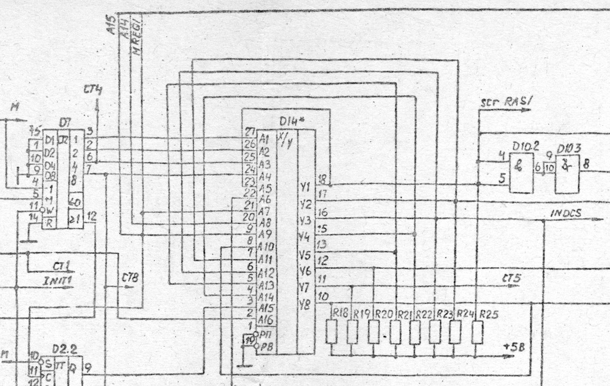

# Santaka002_PLA: D14 01.0A
{WORK IN PROGRESS}

## Files:
* KR556RT1.BIN  
   Output from Arduino
* KR556RT1.TXT  
   ASCII version of BIN file for sanity checking (generated by the Python script)
* xxxxxxxx.TXT  
   One file for each unique output listing the inputs that gave that output (generated by the Python script)

## Special note:
The D14 PLA has several outputs (Y) connected back to the inputs (A):

   A1 (3.5MHz)  
   A2  
   A3  
   A4  
   A5  - Y1  
   A6  
   A7  
   A8  
   A9  
   A10 - Y8  
   A11 - Y2  
   A12 - Y3  
   A13 - Y5  
   A14 - Y4  
   A15  
   A16 (7MHz)  

## D14's location on schematic:

