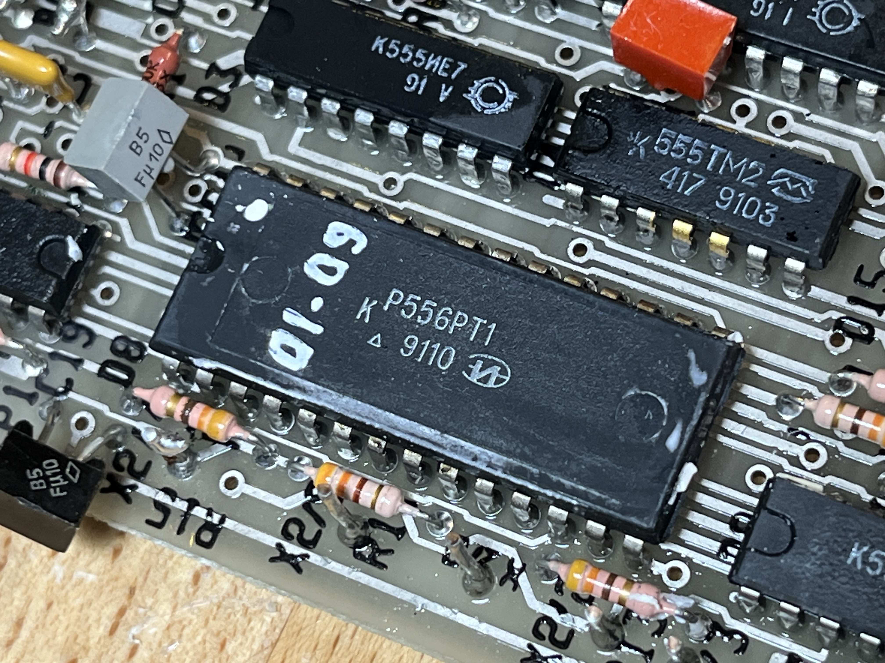
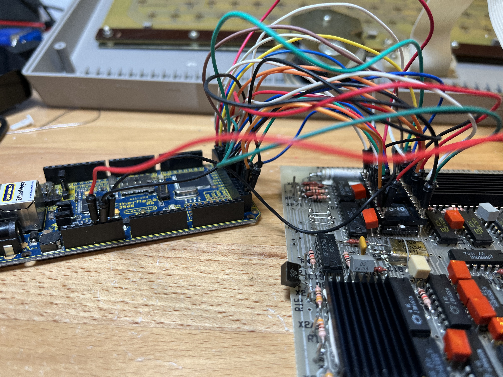

# Sanataka002_PLA
{WORK IN PROGRESS}

Attempts to dump the logic from the PLAs (программируемую логическую матрицу, or "programmable logic matrix") used on the Сантака 002 (Santaka) computer, a Lithuanian/Belarusan clone of the Sinclair ZX Spectrum.

The machine uses several PLAs (Soviet-era КР556РТ1, or KR556RT1) which, as far as we know, are undocumented and thus impossible to replace in a broken machine.

This is an attempt to figure out the logic so that they can be reproduced if needed.

The dumping is performed in-circuit using a Freetronics EtherMega (Arduino Mega compatible with SD interface).  Each combination of 16-bit inputs is applied and the resulting 8-bit output captured.  Information about wiring can be found in the Arduino sketch.

For sanity checking, a Python script is used to convert the binary dump to ASCII.

Further checking will be done on the running machine by capturing the PLA activity using a logic analyser and comparing with the ASCII file.
